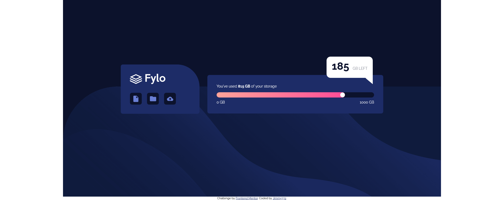

# Frontend Mentor - Fylo data storage component solution

This is a solution to the [Fylo data storage component challenge on Frontend Mentor](https://www.frontendmentor.io/challenges/fylo-data-storage-component-1dZPRbV5n). Frontend Mentor challenges help you improve your coding skills by building realistic projects. 

## Table of contents

- [Overview](#overview)
  - [The challenge](#the-challenge)
  - [Screenshot](#screenshot)
  - [Links](#links)
  - [Built with](#built-with)
  - [What I learned](#what-i-learned)
  - [Useful resources](#useful-resources)

**Note: Delete this note and update the table of contents based on what sections you keep.**

## Overview

### The challenge

Users should be able to:

- View the optimal layout for the site depending on their device's screen size

### Screenshot

### Links

- Solution URL: [here](https://www.frontendmentor.io/solutions/flyo-data-storage-component-solution-using-flexbox-dlE4opiw1I)
- Live Site URL: [here](https://creative-palmier-dd8557.netlify.app/)

### Built with

- Semantic HTML5 markup
- CSS custom properties
- Flexbox
- Desktop-first workflow

### What I learned

This challenged I was mainly trying to improve the structure of my HTML. And although I don't think it was perfect it was an improvement from the last challenge.

### Useful resources

- [chat bubbles](https://codepen.io/run-time/pen/VNRBJd) - This helped me fwith creating the text bubble.
